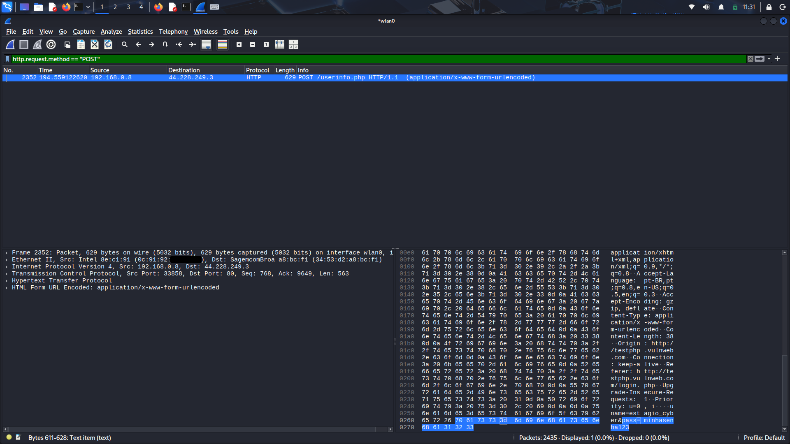

# Auditoria de Redes Local - Mapeamento e Interceptação

## Objetivo
Criar um ambiente de auditoria portátil utilizando o Kali Linux a partir de um pendrive bootável configurado com “persistence” e mapear a superfície de ataque de uma rede local, finalizando com uma prova de conceito e interceptação de credenciais via tráfego não criptografado.

## Ferramentas Utilizadas
* Kali Linux (Live USB Persistence)
* Nmap (Mapeamento via protocolo ARP)
* Wireshark (Análise de tráfego / Sniffing)

---

## 1. Reconhecimento Inicial
Utilizei os comandos `ip a` e `ip route` para localizar os IP's da minha rede e entender quais eram os IP's tanto da minha máquina quanto do meu roteador. Os comandos e seus retornos estão abaixo respectivamente:

```bash
ip a
1: lo: <LOOPBACK,UP,LOWER_UP> mtu 65536 qdisc noqueue state UNKNOWN group default qlen 1000
    link/loopback 00:00:00:00:00:00 brd 00:00:00:00:00:00
    inet 127.0.0.1/8 scope host lo valid_lft forever preferred_lft forever
    inet6 ::1/128 scope host noprefixroute valid_lft forever preferred_lft forever
2: eth0: <NO-CARRIER,BROADCAST,MULTICAST,UP> mtu 1500 qdisc fq_codel state DOWN group default qlen 1000
    link/ether 60:c7:27:**:**:** brd ff:ff:ff:ff:ff:ff
3: wlan0: <BROADCAST,MULTICAST,UP,LOWER_UP> mtu 1500 qdisc noqueue state UP group default qlen 1000
    link/ether 0c:91:92:**:**:** brd ff:ff:ff:ff:ff:ff
    inet 192.168.0.8/24 brd 192.168.0.255 scope global dynamic noprefixroute wlan0
       valid_lft 3581sec preferred_lft 3581sec
    inet6 ------- scope global dynamic noprefixroute
       valid_lft 3585sec preferred_lft 3585sec
    inet6 ------- scope global dynamic noprefixroute
       valid_lft 86383sec preferred_lft 71983sec
    inet6 fe80::7823:f070:ff9a:3cb6/64 scope link noprefixroute
       valid_lft forever preferred_lft forever
```

```bash
ip route
default via 192.168.0.1 dev wlan0 proto dhcp src 192.168.0.8 metric 600
192.168.0.0/24 dev wlan0 proto kernel scope link src 192.168.0.8 metric 600
```

## 2. Mapeamento de Rede (Ping Sweep)
Depois de saber onde eu estava pisando, utilizei o comando `sudo nmap -sn 192.168.0.0/24`. A utilização da flag `-sn` (Ping Sweep) desabilita o escaneamento de portas. Como o Kali Linux estava operando na mesma sub-rede local que os alvos, o Nmap inteligentemente substituiu o tradicional ping ICMP por requisições ARP na Camada de Enlace (L2).

```bash
nmap -sn 192.168.0.0/24
Starting Nmap 7.95 ( [https://nmap.org](https://nmap.org) ) at 2026-03-09 10:55 UTC
Nmap scan report for 192.168.0.1
Host is up (0.0097s latency).
MAC Address: 34:53:D2:**:**:** (Sagemcom Broadband SAS)
Nmap scan report for 192.168.0.2
Host is up (0.15s latency).
MAC Address: CC:6E:A4:**:**:** (Samsung Electronics)
Nmap scan report for 192.168.0.4
Host is up (0.0096s latency).
MAC Address: 18:C0:4D:**:**:** (Giga-byte Technology)
Nmap scan report for 192.168.0.11
Host is up.
MAC Address: 7E:1B:CF:**:**:** (Unknown)
Nmap scan report for 192.168.0.8
Host is up.
Nmap done: 256 IP addresses (5 hosts up) scanned in 9.57 seconds
```

**O Resultado:** Isso tornou a varredura extremamente rápida (concluída em menos de 10 segundos) e furtiva, contornando firewalls de sistemas operacionais locais que comumente descartam pacotes ICMP não solicitados. A partir disso, o gateway da rede (`192.168.0.1`) foi isolado como o alvo primário para a próxima fase.

## 3. Enumeração Fina e Fingerprinting
Posteriormente fiz uso do comando `sudo nmap -sS -sV -O 192.168.0.1` para enumeração fina e fingerpriting (Análise Direcionada). Com o alvo isolado, foi necessário uma varredura agressiva, porém controlada, para mapear os vetores de ataque do roteador.

* **TCP SYN Scan (-sS):** Garantiu uma abordagem furtiva na Camada de Transporte, iniciando o Three-Way Handshake, mas interrompendo-o antes da conexão ser estabelecida, o que evita o registro em logs de aplicações mais simples.
* **Version Detection (-sV):** Foi crucial para ir além de simplesmente saber que uma porta estava aberta; ele extraiu os banners dos serviços (identificando a presença de um servidor HTTP na porta 80).
* **OS Detection (-O):** Analisou as respostas de pilha TCP/IP do alvo para identificar a arquitetura subjacente (revelando um sistema embarcado baseado em Linux).

Segue abaixo o log do sistema:

```bash
sudo nmap -sS -sV -O 192.168.0.1
Starting Nmap 7.95 ( [https://nmap.org](https://nmap.org) ) at 2026-03-09 10:57 UTC
Nmap scan report for 192.168.0.1
Host is up (0.0086s latency).
PORT STATE SERVICE VERSION
80/tcp open http HTTP Server
49152/tcp open unknown
MAC Address: 34:53:D2:**:**:** (Sagemcom Broadband SAS)
Aggressive OS guesses: OpenWrt Kamikaze 7.09 (Linux 2.6.22) (91%), OpenWrt (Linux 2.4.32) (91%)
Network Distance: 1 hop
Nmap done: 1 IP address (1 host up) scanned in 145.02 seconds
```

## 4. Prova de Conceito (PoC): Interceptação de Tráfego em Texto Claro com Wireshark
O mapeamento inicial com o Nmap revelou a presença de portas HTTP (sem criptografia). Para materializar o risco que protocolos legados representam em uma rede local, a próxima etapa consistiu na interceptação de tráfego (Sniffing) utilizando o **Wireshark**, um analisador de protocolos de rede profundo.

**O Ambiente de Teste (Ética e OpSec):**
Para realizar a Prova de Conceito de forma segura e ética, sem expor credenciais reais da minha rede doméstica, utilizei a aplicação web `http://testphp.vulnweb.com/login.php`. Este é um ambiente propositalmente vulnerável, mantido para fins educacionais em cibersegurança, que trafega dados puramente em HTTP (sem a camada de segurança TLS/SSL).

**Metodologia de Captura:**
1. **Escuta Ativa:** Iniciei o Wireshark operando em modo promíscuo na interface sem fio (`wlan0`).
2. **Filtragem Cirúrgica de Ruído:** Uma rede local gera milhares de pacotes por segundo. Para encontrar a "agulha no palheiro", apliquei o filtro de exibição exato: `http.request.method == "POST"`
   * **Justificativa Tática:** O protocolo HTTP utiliza o método `GET` para solicitar páginas e o método `POST` para enviar dados sensíveis (como formulários de login) ao servidor. Ao filtrar estritamente por requisições `POST`, eliminei todo o ruído da rede e isolei o exato momento em que uma credencial foi submetida.

**O Resultado (A Exploração):**
Ao simular um login na aplicação vulnerável (utilizando as credenciais fictícias `uname=estagio_cyber` e `pass=minhasenha123`), o Wireshark interceptou o pacote no ar. Dissecando a Camada de Aplicação do pacote (HTML Form URL Encoded), foi possível ler o *payload* perfeitamente em texto claro, provando a vulnerabilidade crítica da ausência de criptografia ponta a ponta.



## 5. Conclusões e Mitigação Recomendada
Este laboratório comprovou de forma prática que a simples presença em uma rede local permite que um atacante passivo capture dados críticos em trânsito se a infraestrutura depender de protocolos inseguros.

**Recomendações Arquiteturais:**
* **Depreciação de Protocolos Legados:** Forçar o redirecionamento de todo o tráfego HTTP para HTTPS (HTTP Strict Transport Security - HSTS), garantindo o tunelamento criptográfico via TLS/SSL.
* **Segmentação de Rede:** Isolar dispositivos críticos em VLANs separadas para limitar a visibilidade de broadcast e o raio de ação de um potencial atacante interno.
